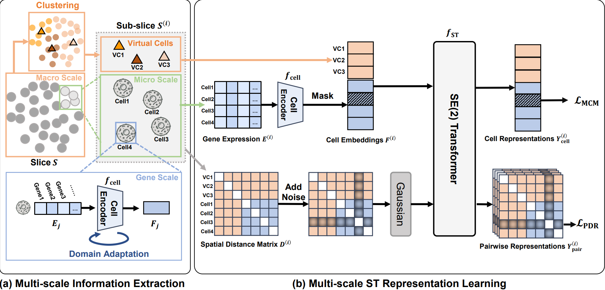

# SToFM: a Multi-scale Foundation Model for Spatial Transcriptomics


Spatial Transcriptomics (ST) technologies provide biologists with rich insights into single-cell biology by preserving spatial context of cells. Building foundational models for ST can significantly enhance the analysis of vast and complex data sources, unlocking new perspectives on the intricacies of biological tissues. However, modeling ST data is inherently challenging due to the need to extract multi-scale information from tissue slices containing vast numbers of cells. This process requires integrating macro-scale tissue morphology, micro-scale cellular microenvironment, and gene-scale gene expression profile. To address this challenge, we propose SToFM, a multi-scale Spatial Transcriptomics Foundation Model. SToFM first performs multi-scale information extraction on each ST slice, to construct a set of ST sub-slices that aggregate macro-, micro- and gene-scale information. Then an SE(2) Transformer is used to obtain high-quality cell representations from the sub-slices. Additionally, we construct \textbf{SToCorpus-88M}, the largest high-resolution spatial transcriptomics corpus for pretraining. SToFM achieves outstanding performance on a variety of downstream tasks, such as tissue region semantic segmentation and cell type annotation, demonstrating its comprehensive understanding of ST data through capturing and integrating multi-scale information.

More information can be found in our [paper](https://arxiv.org/abs/2507.11588).



# Install

[](https://www.python.org/) 
```
pip install -r requirements.txt
```
Among them, geneformer 0.0.1 is no longer available in pypi, so we provide this version of geneformer in this repository. in addition, the installation of raids_singlecell and cupy is a bit more complicated, and the user needs to pick the version of the package that corresponds to the server's cuda version. Please refer to the official websites of these packages.

# Checkpoint 

The checkpoints of the model are divided into two modules: cell encoder and SE(2)-Transformer. For specific loading methods, please refer to the usage in `get_embeddings.py`.

[Download checkpoint](https://drive.google.com/drive/folders/1mHE8gf8MAPwzZoEB0vwOOfQ4lz3H_-xo?usp=sharing)

# Pre-training Dataset

To train SToFM, we construct **SToCorpus-88M**, the largest high-resolution ST pretraining corpus to date. This corpus includes approximately 2,000 high-resolution ST slices obtained by 6 different ST technologies, totaling 88 million cells. **SToCorpus-88M has been publicly released.**

[Download SToCorpus-88M](https://huggingface.co/datasets/Toycat/SToCorpus-88M/tree/main)


# Usage

- **Data preprocess**
Similar to the example in `preprocess/preprocess.py`, you can use `scanpy` to read any single-cell data and process it into a format accepted by the model. The processing method is similar to `Geneformer`. For more detailed instructions, please refer to [Geneformer's tokenizing scRNAseq data example](https://huggingface.co/ctheodoris/Geneformer/blob/main/examples/tokenizing_scRNAseq_data.ipynb).
Specifically, we follow the gene vocabulary of Geneformer, using only human genes. For mouse cells, it is necessary to first map the genes to the human gene vocabulary using homologous genes. 

- **Get embeddings**
You can use the `get_embeddings.py` script to obtain cell embeddings. The script will automatically load the model and tokenizer, and you can specify the path to the preprocessed data. The embeddings will be saved in the specified directory. We have prepared [a demo dataset](https://drive.google.com/drive/folders/1mHE8gf8MAPwzZoEB0vwOOfQ4lz3H_-xo?usp=sharing) for users to try out.

- **Downstream tasks**
In downstream tasks, first use `get_embeddings.py` to obtain cell embeddings. Then, depending on the task requirements, train a specific classification or regression head for prediction. You can experiment with different classification/regression heads for optimal performance on various tasks. 

# Citation
If you find SToFM helpful to your research, please consider giving this repository a 🌟star and 📎citing the following article. Thank you for your support!
```
@article{zhao2025stofm,
  title={SToFM: a Multi-scale Foundation Model for Spatial Transcriptomics},
  author={Zhao, Suyuan and Luo, Yizhen and Yang, Ganbo and Zhong, Yan and Zhou, Hao and Nie, Zaiqing},
  journal={arXiv preprint arXiv:2507.11588},
  year={2025}
}
```
